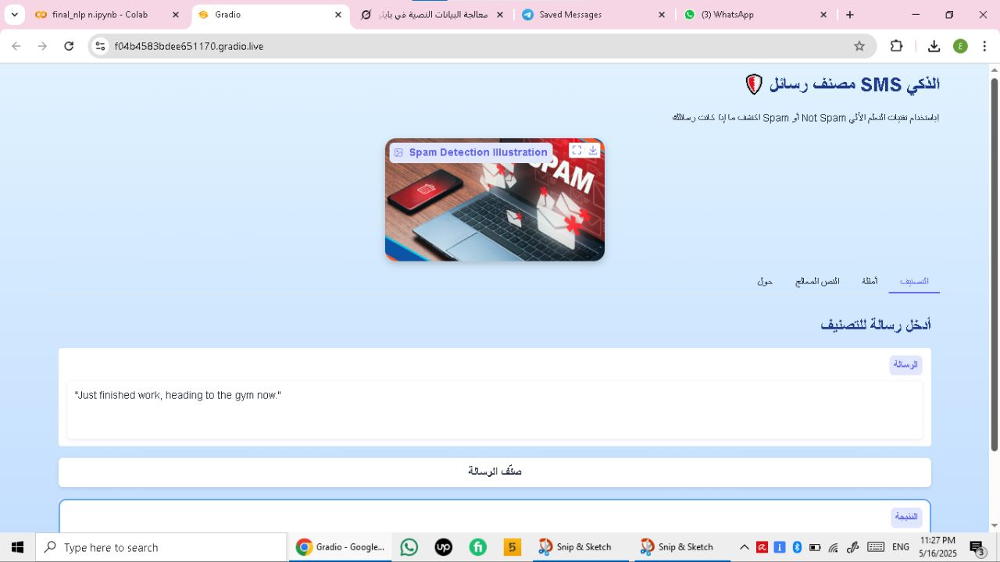

# 🧠 Spam Message Classification (NLP + GUI)

An NLP project that classifies messages as **Spam or Not Spam** using machine learning algorithms.

## 📂 Files in the Project
- `final_nlp_n.ipynb`: main notebook that includes preprocessing, training, and testing.
- `SMS_train.csv` / `SMS_test.csv`: dataset files.
- `vectorizer.pkl`: saved TF-IDF vectorizer.
- `best_model.pkl`: trained ML model.
- `kaggle json`: used for dataset download.
- `IMG_...jpg`: image of the project.
- `VID_...mp4`: demo video for the GUI app.

## 📊 Features
- Data cleaning and preprocessing (removing noise, stopwords, etc.)
- Feature extraction using **TF-IDF**
- Machine Learning models:
  - Naive Bayes
  - Logistic Regression
- Evaluation with accuracy, confusion matrix
- GUI built with **Tkinter** for easy message testing

## 🖼️ Project Demo

🎥 Watch the demo video:
[Demo Video](VID_20250522_161740_990.mp4)

## 🧪 How to Run
1. Clone the repo or download as ZIP
2. Open `final_nlp_n.ipynb` in Jupyter or Colab
3. Make sure the required packages are installed (see below)
4. Run the cells step by step

## 📦 Requirements
You can create a `requirements.txt` like this:

## 🙌 Author
Omar Ramadan  
[LinkedIn](https://www.linkedin.com/in/omar-your-profile)

Added README file with project description
